# Welcome to Obscuripedia!

<div style="text-align:center;">

</div>

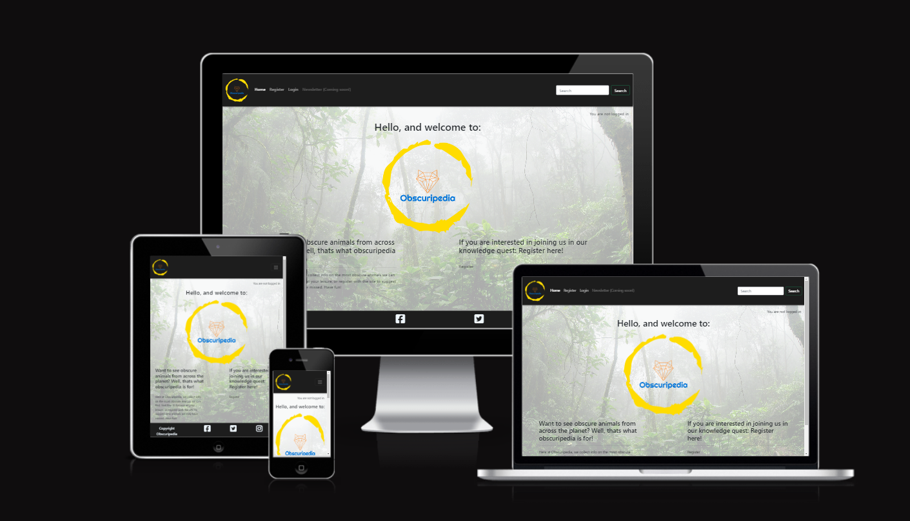

## About

This site was created as a final project for the Code institute 16 week full stack developer course. The full code can be found on GitHub here: https://github.com/CharlB96/CapstoneProject-Obscuripedia

Obscuripedia is intended to document and display information regarding obscure and often overlooked creatures from across the planet. The site is constructed to have any visitor be able to sign up, log in, and log out with ease. The articles are displayed once you are logged in and the search bar can be used to filter the articles. Although the edit-article and add-article buttons appear certain pages, only those designated as staff can add and edit, plus only the staff who created the articles can edit them as well as delete. 
There is also a section for suggestions, which can be made by any user that is logged in. The articles page shows eight articles per page and is paginated so that articles can be continuously added to the site.  


## Original design idea

Originally I was going to use an idea I had discussed with a friend of mine for their personal site, which i already had a basis for. It was going to be a learning resource for school students, but due to the scale of the site and large amount of javascript functionality required, I was advised to go a different direction. 
Here is the original flow chart i created for that initial idea.

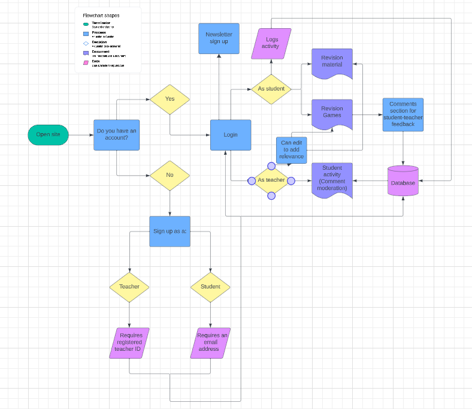


## UX design

When starting this project, I considered a few things before starting. Originally, the project was going to be vastly different, but after discussion with my mentor, I landed on an idea which was more reasonable in scope, thus Obscuripedia was born. 
I wanted to include:
- Easy navigation
- A suggestion page
- A page for aticles
- Register/login functionality
- Ability for staff/admin to add, edit, and delete their own articles
- A navbar for navigation
- A search bar for even easier navigation
- Possibly a newsletter for extra information


## Colour Scheme

The colour scheme was basic with only white, off-white, black, aliceblue, and some custom colours for the social media link highlights

    --background: #f2f2f2;
    --black: #000000e2;
    --white: #fff;
    --off-white: #f6f6f6;
    facebook:hover - color: rgba(98, 114, 237, 0.905);
    twitter:hover - color: rgba(63, 193, 248, 0.905);
    instagram:hover - color: rgba(159, 25, 208, 0.905);


### Typography

Fonts used sequentially:

        --main-font: 'Segoe UI', 'Tahoma', 'Geneva', 'Verdana', 'sans-serif';

## User stories

The user stories were converted into issues with acceptance criteria which were then laid out into a projects board. This is the first time I have experienced an agile development as a single developer, my kanban board can be viewed here: https://github.com/users/CharlB96/projects/4/views/1

- User Story 1: As an animal enthusiast, I want to see obscure animals laid out in an easily readable way so that I can learn new information about creatures i have not heard of before without having to scour a huge article.

- User Story 2: As an animal enthusiast, I want to see details about each animal's taxonomy and location so that I can learn information that is more than just surface level

- User Story 3: As a zoologist, I want to suggest obscure animals that may not be on the website so that I can share my knowledge of obscure fauna with others

- User Story 4: As a casual website visitor (with a mild interest in animals), I want be able to see images of animals so that I can decide, by sight, which animals to view more details on

- User story 5: As a someone who doesn't know much about animals, I want to access some kind of exta infor so that learn more about the site in general

- User Story 6: As an animal enthusiast, I want have special admin access so that edit mistakes or add information to existing pages

- User story 7: As a user, I want to be able to save my favorite obscure animals or create a personal collection for future reference.

- User story 8: As a user, I want the website to be accessible and responsive on various devices, so I can explore obscure animals on my desktop, tablet, or mobile phone.

## Kanban board

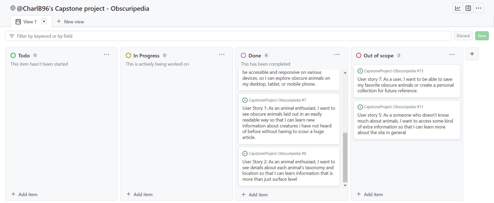


## Wire Frames

- #### Articles page


- #### Article detail (staff)


- #### Article detail (not staff)


- #### Suggestion page


- #### Home page (logged in)


- #### Home page (logged out)


## Features

### Current features 

#### Home page (logged in)

Welcomes visiters and guides them to the articles page ('Lets see them animals!') through the line at the bottom
The navbar points to a sign out page, a suggestion page, a 'lets see them animals' page (Articles page), and a deactivated newsletter button, there is also a search bar, which will bring up any article realated to what you enter.

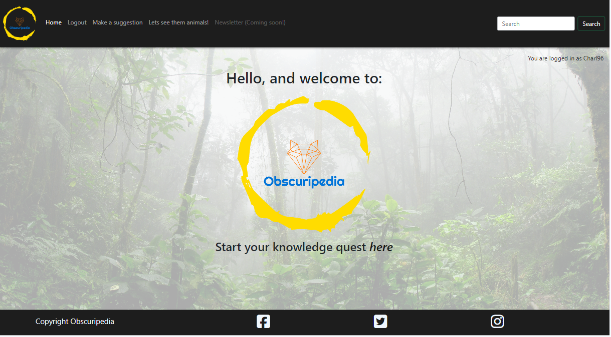


#### Home page (logged out)

Welcomes visiters, gives a bre=ief overview of the site, and guides you too the login page
The navbar points to a register page, a login page, and a deactivated newsletter button, there is also a search bar, which will say there are no searches that match if you use it when logged out


#### Register page

Allows visiters to register with the site witha username or password

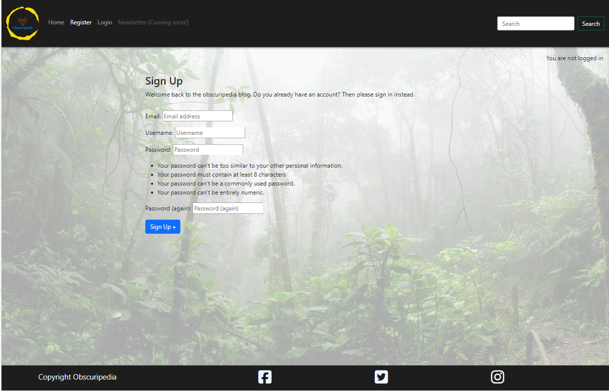


#### Sign in page

Allows registered visiters to sign in and view the animals

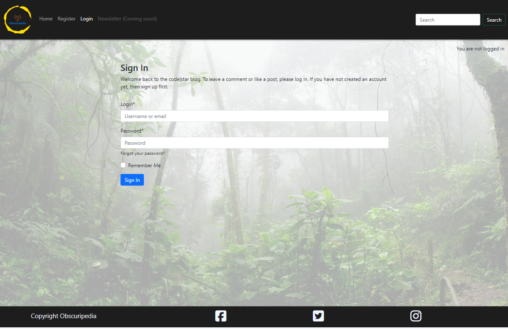


#### Sign out page

Allows registered visiters to sign out if they so wish

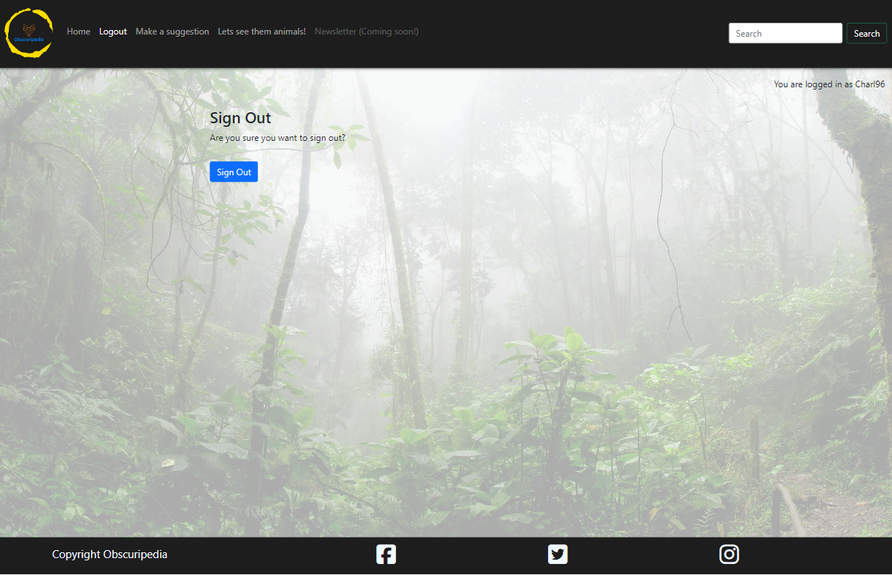


#### Suggestion page

Allows registered users to send suggestions about animals they want to include on the site, these are then viewable through the admin page by staff. This is a good way to expand and improve the site's content

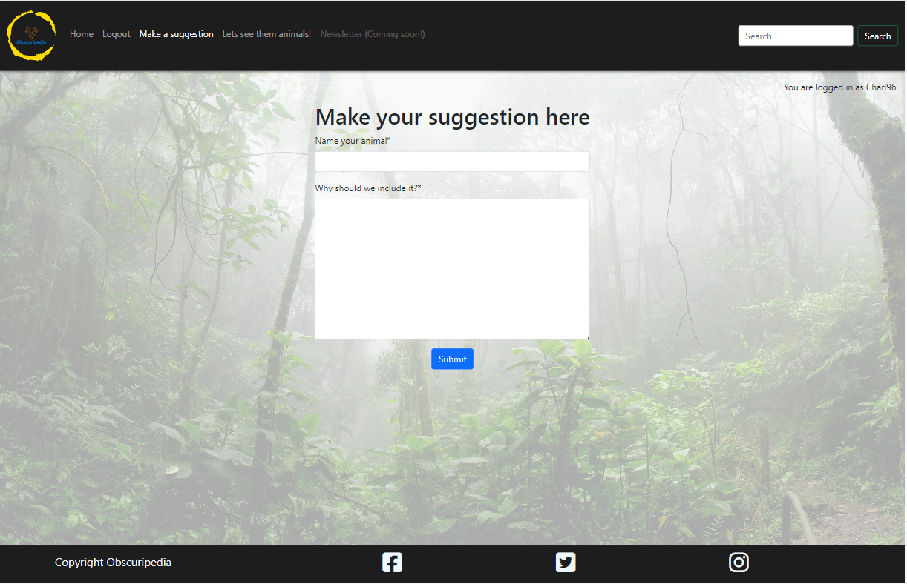


#### Articles page (top)

This page displays all the basic information about all the animals currently viewable on the site, the bootstrap cards have clickable buttons which open into the article detail pages

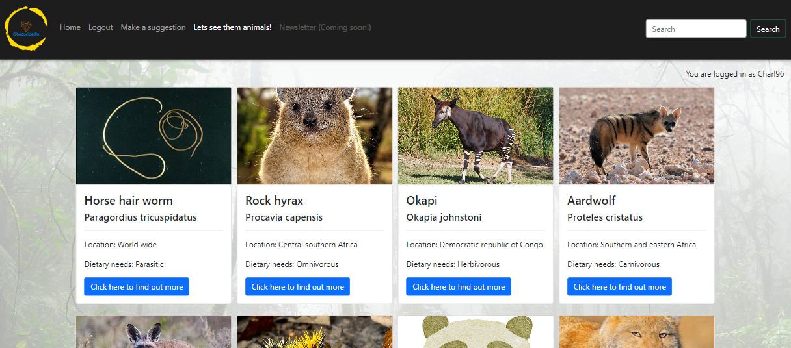


#### Articles page (bottom)

This page displays all the basic information about all the animals currently viewable on the site, the bootstrap cards have clickable buttons which open into the article detail pages

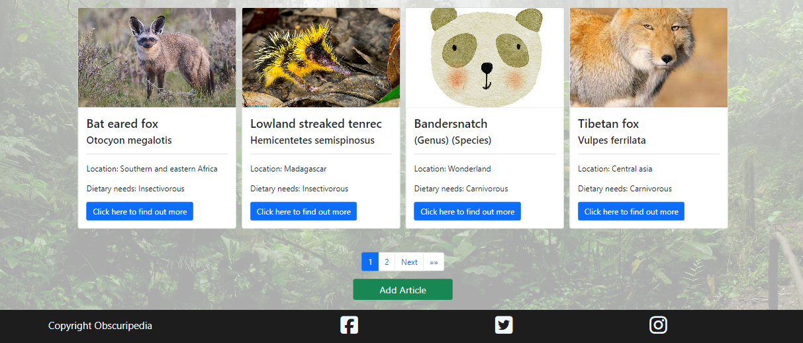


#### Article detail (Staff/admin)

The article detail pages show the extra information about the animal that you clicked on, there is an image of the animal, some details about the animal, a description, and a map showing the general location of the animal's habitat. The staff page has an edit article button and a delete button. If the article was written by the staff memeber, they are able to update and delete the article as they wish, if they are not the author of the article, an error will appear at the top of the page, refusing permission.

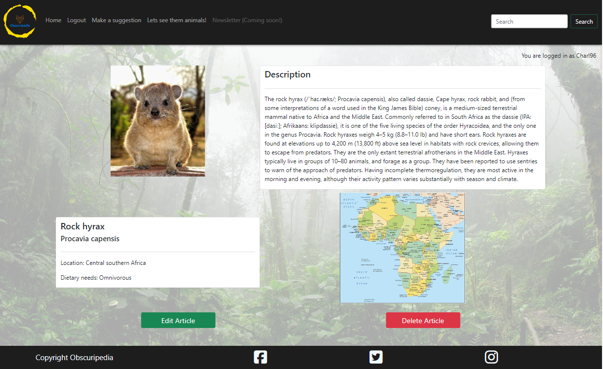


#### Article detail (Regular user)

The article detail pages show the extra information about the animal that you clicked on, there is an image of the animal, some details about the animal, a description, and a map showing the general location of the animal's habitat. The regular user's page has an edit article button but, when clicked, an error will appear saying you do not have permission to edit this article.

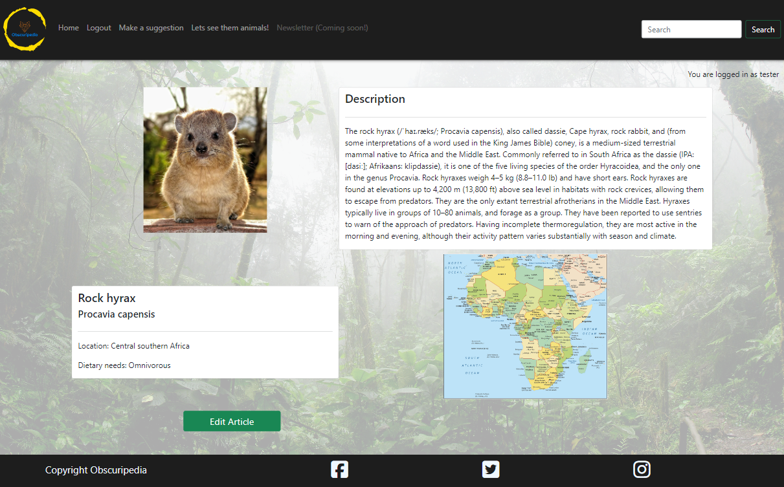

#### Add article (top)

This page allows authorised users (staff) to add articles wwhich can then be appreoved in the admin page

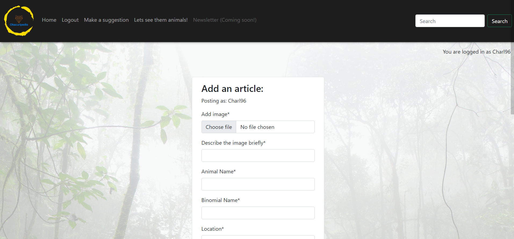

#### Add article (bottom)

This page allows authorised users (staff) to add articles wwhich can then be appreoved in the admin page

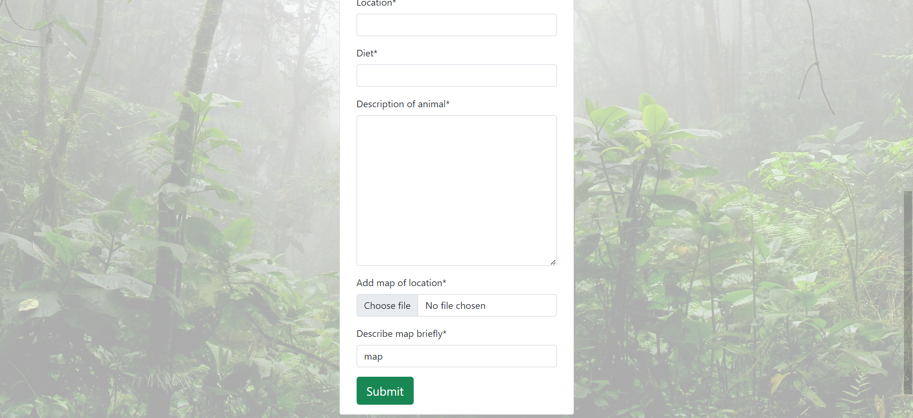

#### Edit article

This page allows authorised users (staff) to edit articles wwhich do not require approval. As you can see, it is not disimilar to the add article form, however the form is already filled in with information pertaining to the article clicked on

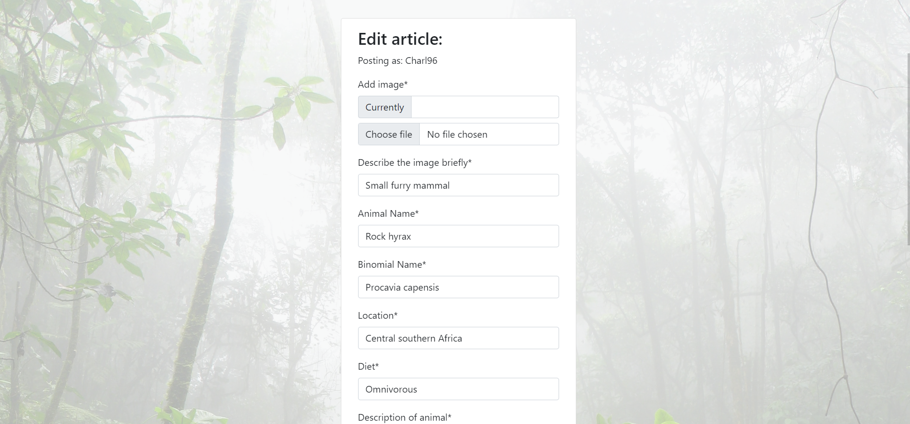


## Frameworks, Libraries & Progams Used

  - \[Django\](https://www.djangoproject.com): Basis for project
  - \[Cloudinary\](https://www.cloudinary.com): Free image store
  - \[Heroku\](https://dashboard.heroku.com/): Host for site
  - \[Bootstrap 5.1\](https://getbootstrap.com/docs/5.1/getting-started/introduction/): Used for responsiveness and css classes
  - \[ElephantSQL\](https://www.elephantsql.com): Used as free database
  - \[ChatGPT\](https://chat.openai.com): Used for identifying errors and correcting existing code
  - \[Git\](https://gitpod.io): Used for version control, commits and pushes done through terminal
  - \[GitHub\](https://github.com): Repository store pushed to
  - \[AmIresponsive\](https://ui.dev/amiresponsive): Used to show responsiveness at top of the README
  - \[LucidChart\](https://lucid.app): Used to create basic flowchart for site functionality (Before idea change)


## Database design

Entity Relationship Diagrams (ERD) help to visualize database architecture before creating models.
Understanding the relationships between different tables can save time later in the project.

```python
class Article(models.Model):
    """
    A model for superuser to create, read, update, and delete articles
    """
    user = models.ForeignKey(User, related_name="author", on_delete=models.CASCADE)
    image = CloudinaryField('image', default='placeholder')
    image_alt = models.CharField(max_length=50, null=False, blank=False)
    animal_name = models.CharField(max_length=50, null=False, blank=False)
    binomial_name = models.CharField(max_length=50, null=False, blank=False)
    location = models.CharField(max_length=50, null=False, blank=False)
    diet = models.CharField(max_length=30, null=False, blank=False)
    description = models.TextField(null=False, blank=False)
    post_date = models.DateTimeField(auto_now=True)
    map = CloudinaryField('map', default='placeholder-map')
    map_alt = models.CharField(max_length=50, null=False, blank=False, default="map")
    approved = models.BooleanField(default=False)

    class Meta:
        ordering = ['post_date']

    def __str__(self):
        return f"{self.animal_name} - {self.binomial_name}"
```

  | **PK** | **id** (unique) | Type | Notes |
| --- | --- | --- | --- |
| **FK** | user | ForeignKey | FK to **User** model (related_name="author") |
| | image | CloudinaryField | Default: 'placeholder' |
| | image_alt | CharField | Max Length: 50, Not Null, Not Blank |
| | animal_name | CharField | Max Length: 50, Not Null, Not Blank |
| | binomial_name | CharField | Max Length: 50, Not Null, Not Blank |
| | location | CharField | Max Length: 50, Not Null, Not Blank |
| | diet | CharField | Max Length: 30, Not Null, Not Blank |
| | description | TextField | Not Null, Not Blank |
| | post_date | DateTimeField | Auto Now |
| | map | CloudinaryField | Default: 'placeholder-map' |
| | map_alt | CharField | Max Length: 50, Not Null, Not Blank, Default: 'map' |
| | approved | BooleanField | Default: False |


## Agile Development Process

### GitHub Projects

[GitHub Projects](https://github.com/CharlB96/CapstoneProject-Obscuripedia/projects) served as an Agile tool for this project.
It isn't a specialized tool, but with the right tags and project creation/issue assignments, it can be made to work.

Through it, user stories, issues, and milestone tasks were planned, then tracked on a weekly basis using the basic Kanban board.

- [Open issues](https://github.com/CharlB96/CapstoneProject-Obscuripedia/issues)

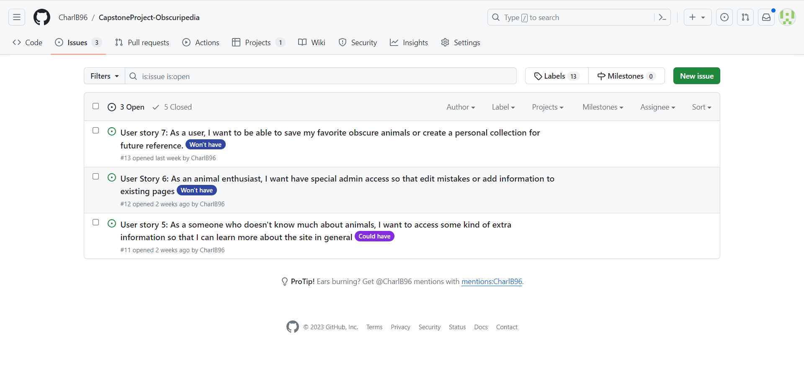

- [Closed issues](https://github.com/CharlB96/CapstoneProject-Obscuripedia/issues?q=is%3Aissue+is%3Aclosed)

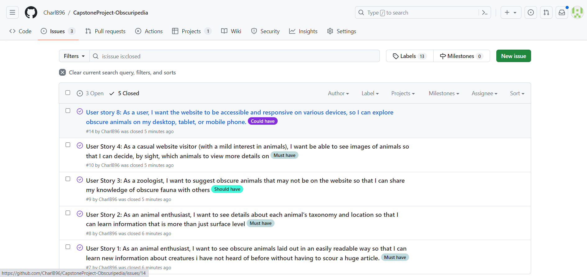


### MoSCoW Prioritization

I've decomposed my Epics into stories prior to prioritizing and implementing them.
Using this approach, I was able to apply the MoSCow prioritization and labels to my user stories within the Issues tab.

- **Must Have**: guaranteed to be delivered (*max 60% of stories*)
- **Should Have**: adds significant value, but not vital (*the rest ~20% of stories*)
- **Could Have**: has small impact if left out (*20% of stories*)
- **Won't Have**: not a priority for this iteration


## Testing

For all testing, please refer to the [TESTING.md](TESTING.md) file.

## Deployment

The live deployed application can be found deployed on [Heroku](https://capstone-project-obscuripedia-43e18bf1264b.herokuapp.com).

### ElephantSQL Database

This project uses [ElephantSQL](https://www.elephantsql.com) for the PostgreSQL Database.

To obtain your own Postgres Database, sign-up with your GitHub account, then follow these steps:

- Click **Create New Instance** to start a new database.
- Provide a name (this is commonly the name of the project: CapstoneProject-Obscuripedia).
- Select the **Tiny Turtle (Free)** plan.
- You can leave the **Tags** blank.
- Select the **Region** and **Data Center** closest to you.
- Once created, click on the new database name, where you can view the database URL and Password.

### Cloudinary API

This project uses the [Cloudinary API](https://cloudinary.com) to store media assets online, due to the fact that Heroku doesn't persist this type of data.

To obtain your own Cloudinary API key, create an account and log in.

- For *Primary interest*, you can choose *Programmable Media for image and video API*.
- Optional: *edit your assigned cloud name to something more memorable*.
- On your Cloudinary Dashboard, you can copy your **API Environment Variable**.
- Be sure to remove the `CLOUDINARY_URL=` as part of the API **value**; this is the **key**.

### Heroku Deployment

This project uses [Heroku](https://www.heroku.com), a platform as a service (PaaS) that enables developers to build, run, and operate applications entirely in the cloud.

Deployment steps are as follows, after account setup:

- Select **New** in the top-right corner of your Heroku Dashboard, and select **Create new app** from the dropdown menu.
- Your app name must be unique, and then choose a region closest to you (EU or USA), and finally, select **Create App**.
- From the new app **Settings**, click **Reveal Config Vars**, and set your environment variables.

| Key | Value |
| --- | --- |
| `CLOUDINARY_URL` | user's own value |
| `DATABASE_URL` | user's own value |
| `DISABLE_COLLECTSTATIC` | 1 (*this is temporary, and can be removed for the final deployment*) |
| `SECRET_KEY` | user's own value |

Heroku needs two additional files in order to deploy properly.

- requirements.txt
- Procfile

You can install this project's **requirements** (where applicable) using:

- `pip3 install -r requirements.txt`

If you have your own packages that have been installed, then the requirements file needs updated using:

- `pip3 freeze --local > requirements.txt`

The **Procfile** can be created with the following command:

- `echo web: gunicorn app_name.wsgi > Procfile`
- *replace **app_name** with the name of your primary Django app name; the folder where settings.py is located*

For Heroku deployment, follow these steps to connect your own GitHub repository to the newly created app:

Either:

- Select **Automatic Deployment** from the Heroku app.

Or:

- In the Terminal/CLI, connect to Heroku using this command: `heroku login -i`
- Set the remote for Heroku: `heroku git:remote -a app_name` (replace *app_name* with your app name)
- After performing the standard Git `add`, `commit`, and `push` to GitHub, you can now type:
	- `git push heroku main`

The project should now be connected and deployed to Heroku!

### Local Deployment

This project can be cloned or forked in order to make a local copy on your own system.

For either method, you will need to install any applicable packages found within the *requirements.txt* file.

- `pip3 install -r requirements.txt`.

You will need to create a new file called `env.py` at the root-level,
and include the same environment variables listed above from the Heroku deployment steps.

Sample `env.py` file:

```python
import os

os.environ.setdefault("CLOUDINARY_URL", "user's own value")
os.environ.setdefault("DATABASE_URL", "user's own value")
os.environ.setdefault("SECRET_KEY", "user's own value")

# local environment only (do not include these in production/deployment!)
os.environ.setdefault("DEBUG", "True")
```

Once the project is cloned or forked, in order to run it locally, you'll need to follow these steps:

- Start the Django app: `python3 manage.py runserver`
- Stop the app once it's loaded: `CTRL+C` or `⌘+C` (Mac)
- Make any necessary migrations: `python3 manage.py makemigrations`
- Migrate the data to the database: `python3 manage.py migrate`
- Create a superuser: `python3 manage.py createsuperuser`
- Load fixtures (if applicable): `python3 manage.py loaddata file-name.json` (repeat for each file)
- Everything should be ready now, so run the Django app again: `python3 manage.py runserver`

#### Cloning

You can clone the repository by following these steps:

1. Go to the [GitHub repository](https://github.com/CharlB96/CapstoneProject-Obscuripedia) 
2. Locate the Code button above the list of files and click it 
3. Select if you prefer to clone using HTTPS, SSH, or GitHub CLI and click the copy button to copy the URL to your clipboard
4. Open Git Bash or Terminal
5. Change the current working directory to the one where you want the cloned directory
6. In your IDE Terminal, type the following command to clone my repository:
	- `git clone https://github.com/CharlB96/CapstoneProject-Obscuripedia.git`
7. Press Enter to create your local clone.

Alternatively, if using Gitpod, you can click below to create your own workspace using this repository.

[](https://gitpod.io/#https://github.com/CharlB96/CapstoneProject-Obscuripedia)

Please note that in order to directly open the project in Gitpod, you need to have the browser extension installed.
A tutorial on how to do that can be found [here](https://www.gitpod.io/docs/configure/user-settings/browser-extension).

#### Forking

By forking the GitHub Repository, we make a copy of the original repository on our GitHub account to view and/or make changes without affecting the original owner's repository.
You can fork this repository by using the following steps:

1. Log in to GitHub and locate the [GitHub Repository](https://github.com/CharlB96/CapstoneProject-Obscuripedia)
2. At the top of the Repository (not top of page) just above the "Settings" Button on the menu, locate the "Fork" Button.
3. Once clicked, you should now have a copy of the original repository in your own GitHub account!


## Extra

### Acknowledgements
- I would like to thank my Code Institute mentor, [Tim Nelson](https://github.com/TravelTimN) for their support throughout the development of this project.
- I would like to thank the [Code Institute](https://codeinstitute.net) tutor team for their assistance with troubleshooting and debugging some project issues.
- I would like to thank the [Code Institute Slack community](https://code-institute-room.slack.com) for the moral support; it kept me going during periods of self doubt and imposter syndrome.
- I would like to thank my partner Emma for supporting me through this educational experience.
- ChatGPT was used throughout to identify issues in the code (Spelling mistakes, Structrual issues, etc) (https://chat.openai.com/)
- Wikipedia was used for animal information in the articles, along with many of the images (https://www.wikipedia.org/)

Future plans:
- The site could definitely use some expanding in the number of articles made, as well as the amount of information on each animal. Due to time constraints, I created a few articles with limited information, the majority of which was sourced directly from wikipedia. I would want to create fully unique articles per animal and structure the pages with rich text fields to add a bit more style.
- I would want to fully construct the newsletter page and the newsletter itself, possibly to open onto a new page.
- I would want to create a profile page where you can save articles of your favourtite animals and personalise the page somewhat.


### Media references

- Logo: Logo created using logo maker on YourLogo.com

Images: 
- Placeholder image sourced from https://pixabay.com/ from user Piyapong89
- Echidna image sourced from https://www.edgeofexistence.org/blog/the-search-for-payangko-finding-attenboroughs-long-beaked-echidna/
- Tenrec image sourced from https://www.flickr.com/photos/hakoar/7814268658
- Placeholder-map sourced from https://www.tor.com/2017/08/01/tolkiens-map-and-the-messed-up-mountains-of-middle-earth/
- Maps sourced from https://gisgeography.com/
- Tibetan Fox image sourced from https://safeworldwide.org/species-in-peril/tibetan-fox/
- Other animal images sourced from related wikipedia articles
- Background image sourced from https://www.pexels.com/search/rainforest/

- Information: All information sourced from wikipedia, in the actual site, the information would be from multiple sources and written transformatively