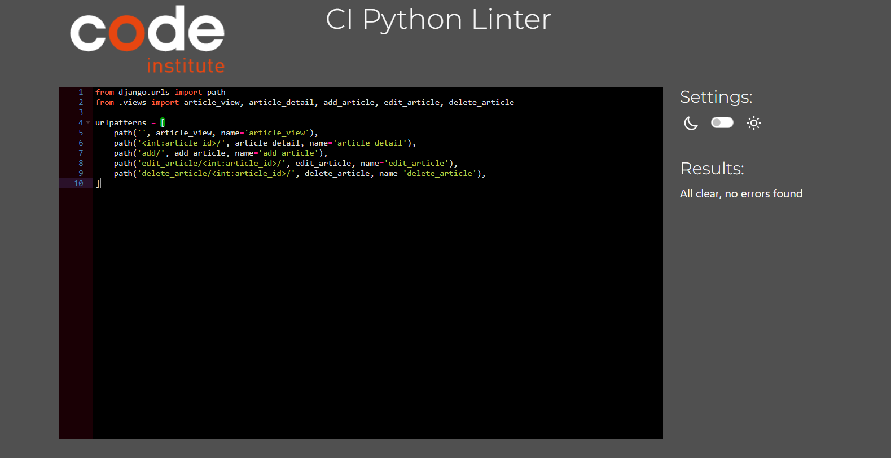

# Welcome to Obscuripedia!

[Obscuripedia logo](static/images/obscuripedia-high-resolution-logo-transparent.png)

## About

This site was created as a final project for the Code institute 16 week full stack developer course. The full code can be found on GitHub here: https://github.com/CharlB96/CapstoneProject-Obscuripedia

Obscuripedia is intended to document and display information regarding obscure and often overlooked creatures from across the planet. The site is constructed to have any visitor be able to sign up, log in, and log out with ease. The articles are displayed once you are logged in and the search bar can be used to filter the articles. Although the edit-article and add-article buttons appear certain pages, only those designated as staff can add and edit, plus only the staff who created the articles can edit them as well as delete. 
There is also a section for suggestions, which can be made by any user that is logged in. The articles page shows eight articles per page and is paginated so that articles can be continuously added to the site.  

### User stories

User Story 1: As an animal enthusiast, I want to see obscure animals laid out in an easily readable way so that I can learn new information about creatures i have not heard of before without having to scour a huge article.

User Story 2: As an animal enthusiast, I want to see details about each animal's taxonomy and location so that I can learn information that is more than just surface level

User Story 3: As a zoologist, I want to suggest obscure animals that may not be on the website so that I can share my knowledge of obscure fauna with others

User Story 4: As a casual website visitor (with a mild interest in animals), I want be able to see images of animals so that I can decide, by sight, which animals to view more details on

User story 5: As a someone who doesn't know much about animals, I want to access some kind of exta infor so that learn more about the site in general

User Story 6: As an animal enthusiast, I want have special admin access so that edit mistakes or add information to existing pages

User story 7: As a user, I want to be able to save my favorite obscure animals or create a personal collection for future reference.

User story 8: As a user, I want the website to be accessible and responsive on various devices, so I can explore obscure animals on my desktop, tablet, or mobile phone.

### Wire Frames

### Major Bugs

Dealt with various issues during develpoment including:
    - Issue loading page; forgot to migrate after changing model
    - Difficulty getting responsiveness; had to experiment with bootstrap classes until it was right
    - Images not uploading when using form; added request.FILES to view
    - Internal server error when deploying to heroku; commented out the STATIC_FILE_STORAGE in settings.py

### Media references

- Logo: Logo created using logo maker on YourLogo.com

- Images: Placeholder image sourced from Pixabay.com from user Piyapong89
          Echidna image sourced from https://www.edgeofexistence.org/blog/the-search-for-payangko-finding-attenboroughs-long-beaked-echidna/
          Tenrec image sourced from https://www.flickr.com/photos/hakoar/7814268658
          Placeholder-map sourced from https://www.tor.com/2017/08/01/tolkiens-map-and-the-messed-up-mountains-of-middle-earth/
          Maps sourced from https://gisgeography.com/
          Tibetan Fox image sourced from https://safeworldwide.org/species-in-peril/tibetan-fox/
          Other animal images sourced from related wikipedia articles
          Background image sourced from https://www.pexels.com/search/rainforest/

- Information: All information sourced from wikipedia, in the actual site, the information would be from multiple sources and written transformatively

- Validation:
        The large amount of warnings are all due to bootstrap classes
        

- Testing:
        Testing of the views was done consistently throughout. When signed out, only the home, login, register, and inactive newsletter pages are visible. When logged in, the home, suggestion, 'lets see them animals', log out and inactive newsletter pages are active. When accessing the articles page, the add article button is visible whether logged in or not, however, if you try to press the button and are not logged in, an error will appear saiyng you need to be at least an admin to add an aarticle and you will be taken back to the articles page.
        When logged in (as staff) the add article button takes you to a form with all the relevant fields to fill in. 
        https://docs.google.com/document/d/1fxGQ2t37Pz854mK3BgLMoRH8PplrdpIK7yQzlYmHDnU/edit?usp=sharing

- Acknowledgements:
        ChatGPT was used throughout to identify issues in the code (Spelling mistakes, Structrual issues, etc)

- Future plans:
        The site could definitely use some expanding in the number of articles made, as well as the amount of information on each animal. Due to time constraints, I created a few articles with limited information, the majority of which was sourced directly from wikipedia. I would want to create fully unique articles per animal and structure the pages with rich text fields to add a bit more style.

        I would want to fully construct the newsletter page and the newsletter itself, possibly to open onto a new page.

        I would want to create a profile page where you can save articles of your favourtite animals and personalise the page somewhat.