# Testing

Return back to the [README.md](README.md) file.

## Code Validation

### HTML

I have used the recommended [HTML W3C Validator](https://validator.w3.org) to validate all of my HTML files.

| Page | W3C URL | Screenshot | Notes |
| --- | --- | --- | --- |
| Home | [W3C](https://validator.w3.org/nu/?doc=https%3A%2F%2FCharlB96.github.io%2FCapstoneProject-Obscuripedia%2Findex.html) | 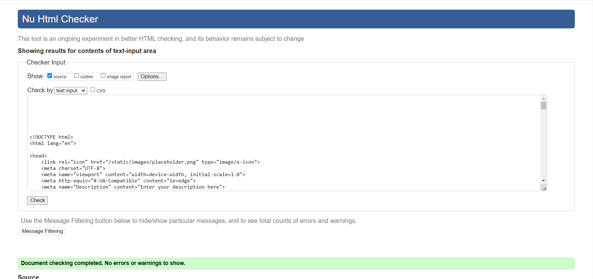 | Pass: No Errors |
| Suggestion | [W3C](https://validator.w3.org/nu/?doc=https%3A%2F%2FCharlB96.github.io%2FCapstoneProject-Obscuripedia%2Fsuggestion.html) | 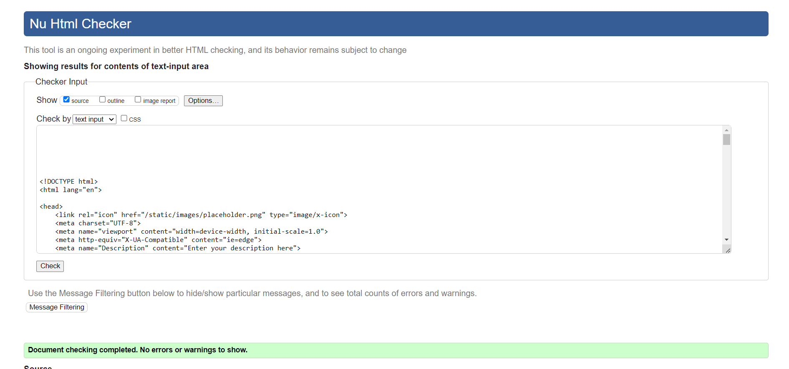 | Pass: No Errors |
| Sign out | [W3C](https://validator.w3.org/nu/?doc=https%3A%2F%2FCharlB96.github.io%2FCapstoneProject-Obscuripedia%2Flogout.html) | 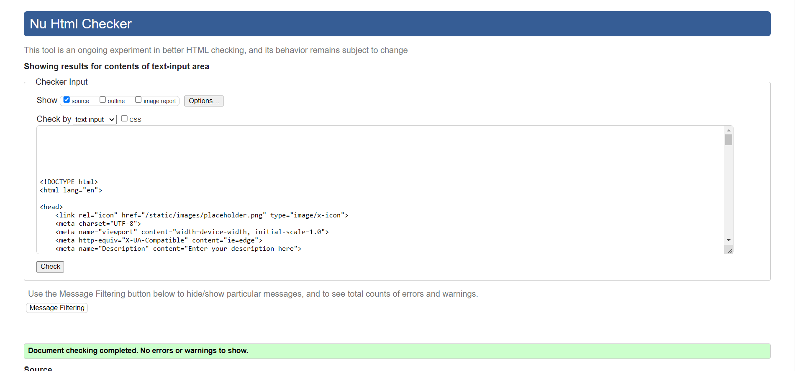 | Pass: No Errors |
| Login | [W3C](https://validator.w3.org/nu/?doc=https%3A%2F%2FCharlB96.github.io%2FCapstoneProject-Obscuripedia%2Flogin.html) | 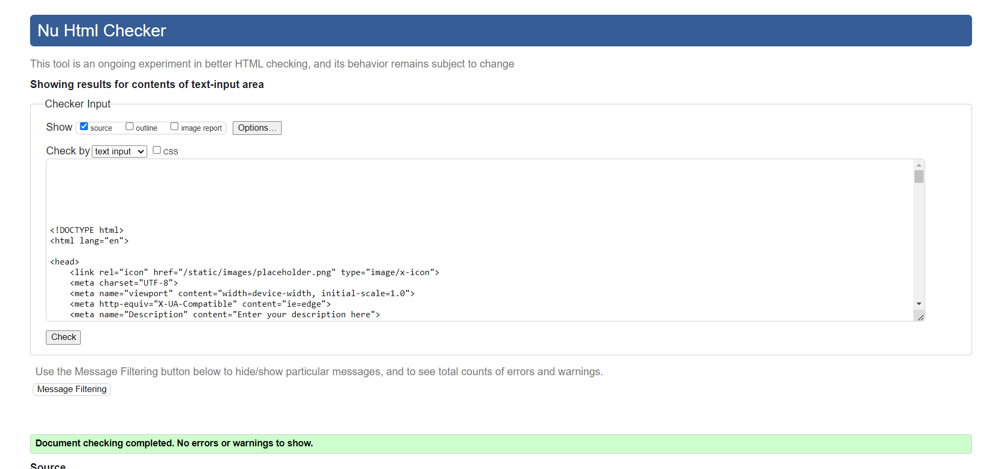 | Pass: No Errors |
| Register | [W3C](https://validator.w3.org/nu/?doc=https%3A%2F%2FCharlB96.github.io%2FCapstoneProject-Obscuripedia%2Fsignup.html) | 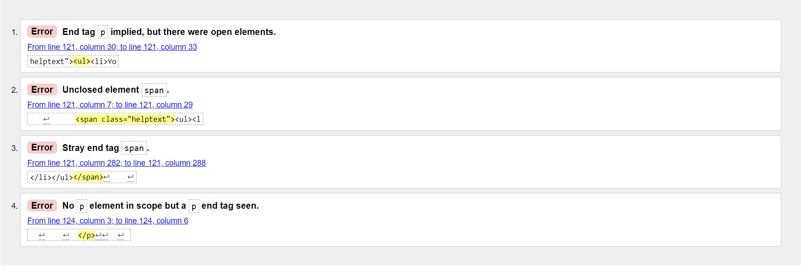 | Validation claims floating elements, but the elements are all present. Django allauth was used for this page so there may be an issue in the baseline code for that |
| Articles | [W3C](https://validator.w3.org/nu/?doc=https%3A%2F%2FCharlB96.github.io%2FCapstoneProject-Obscuripedia%2Fpedia.html) | 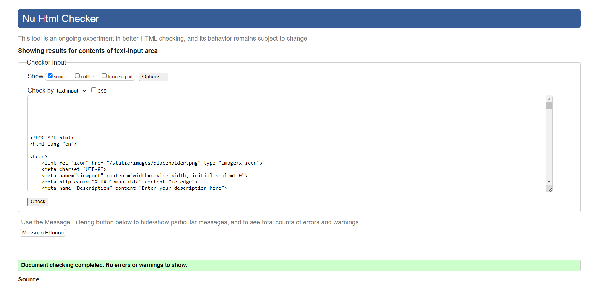 | Pass: No Errors |
| Article detail | [W3C](https://validator.w3.org/nu/?doc=https%3A%2F%2FCharlB96.github.io%2FCapstoneProject-Obscuripedia%2Fpedia/20.html) | 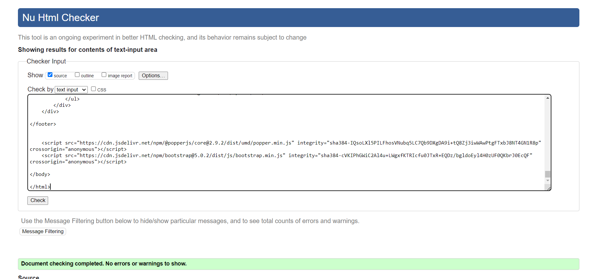 | Pass: No Errors |
| Add article | [W3C](https://validator.w3.org/nu/?doc=https%3A%2F%2FCharlB96.github.io%2FCapstoneProject-Obscuripedia%2Fpedia/add.html) | 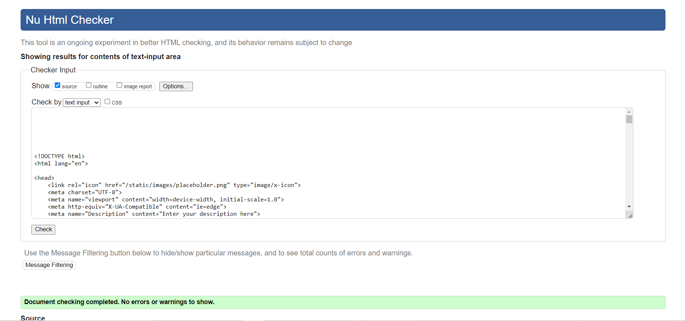 | Pass: No Errors |
| Edit article | [W3C](https://validator.w3.org/nu/?doc=https%3A%2F%2FCharlB96.github.io%2FCapstoneProject-Obscuripedia%2Fpedia/edit_article/20.html) | 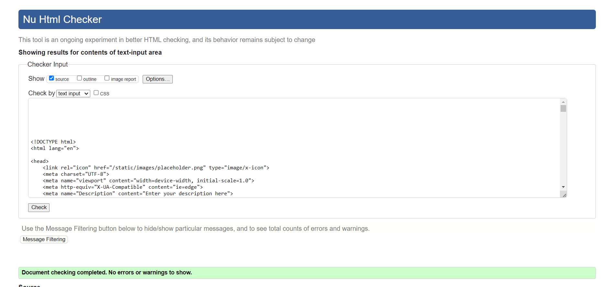 | Pass: No Errors |

### CSS

I have used the recommended [CSS Jigsaw Validator](https://jigsaw.w3.org/css-validator) to validate all of my CSS files.

| File | Jigsaw URL | Screenshot | Notes |
| --- | --- | --- | --- |
| base.css | [Jigsaw](https://jigsaw.w3.org/css-validator/validator?uri=https%3A%2F%2FCharlB96.github.io%2FCapstoneProject-Obscuripedia) | 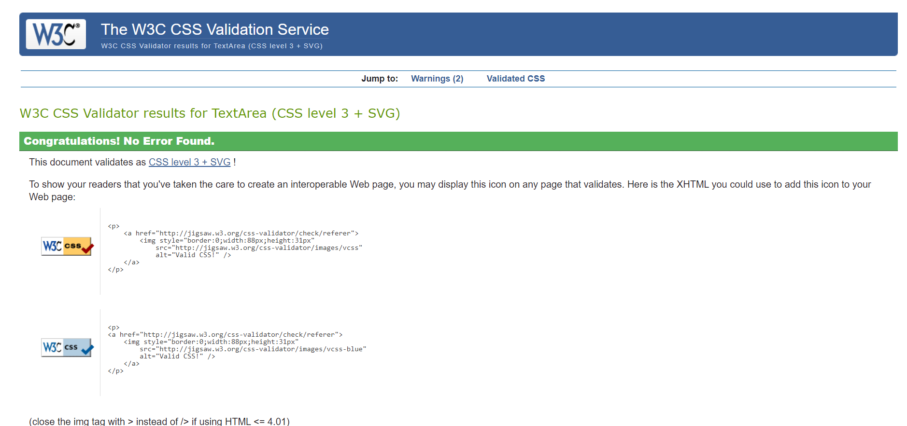 | Pass: No Errors |

### Python

I have used the recommended [PEP8 CI Python Linter](https://pep8ci.herokuapp.com) to validate all of my Python files.

| File | CI URL | Screenshot | Notes |
| --- | --- | --- | --- |
| main settings.py | [PEP8 CI](https://pep8ci.herokuapp.com/https://raw.githubusercontent.com/CharlB96/capstoneproject-obscuripedia/main/settings.py) | 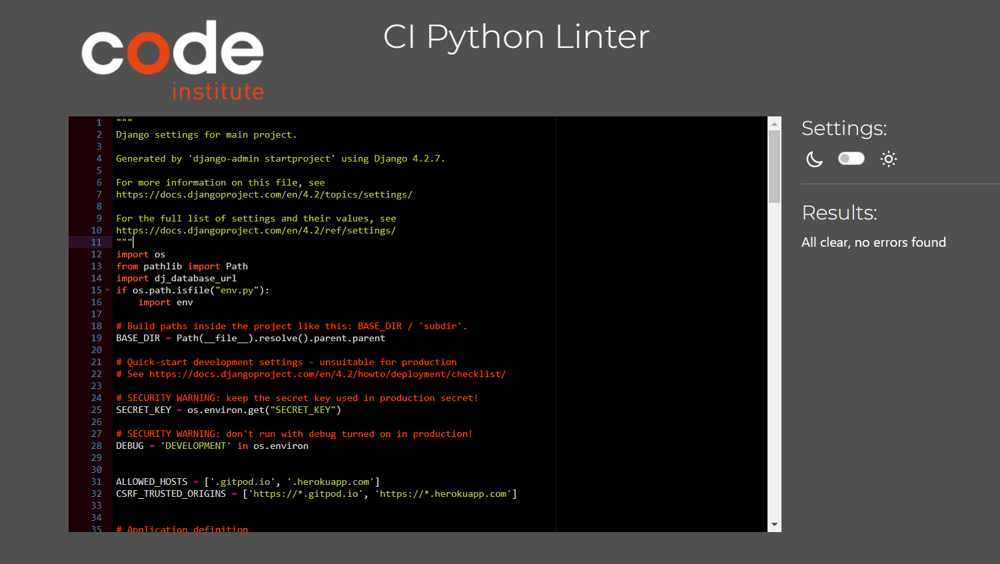 | Pass: No Error |
| home views.py | [PEP8 CI](https://pep8ci.herokuapp.com/https://raw.githubusercontent.com/CharlB96/capstoneproject-obscuripedia/home/views.py) | 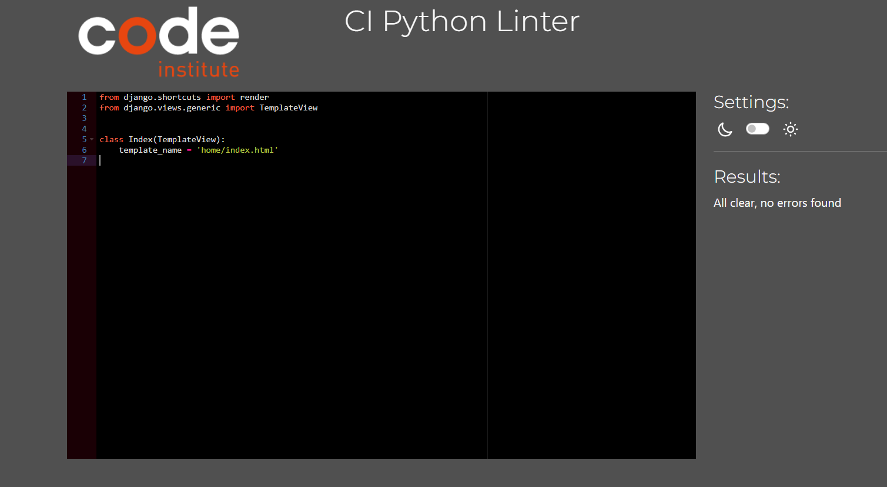 | Pass: No Error |
| home urls.py | [PEP8 CI](https://pep8ci.herokuapp.com/https://raw.githubusercontent.com/CharlB96/capstoneproject-obscuripedia/home/urls.py) | 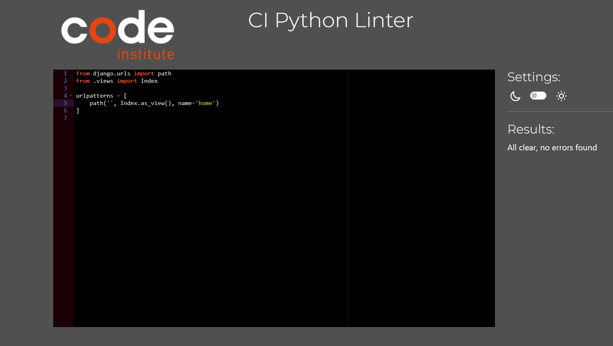 | Pass: No Errors |
| suggestion models.py | [PEP8 CI](https://pep8ci.herokuapp.com/https://raw.githubusercontent.com/CharlB96/capstoneproject-obscuripedia/suggestion/models.py) | 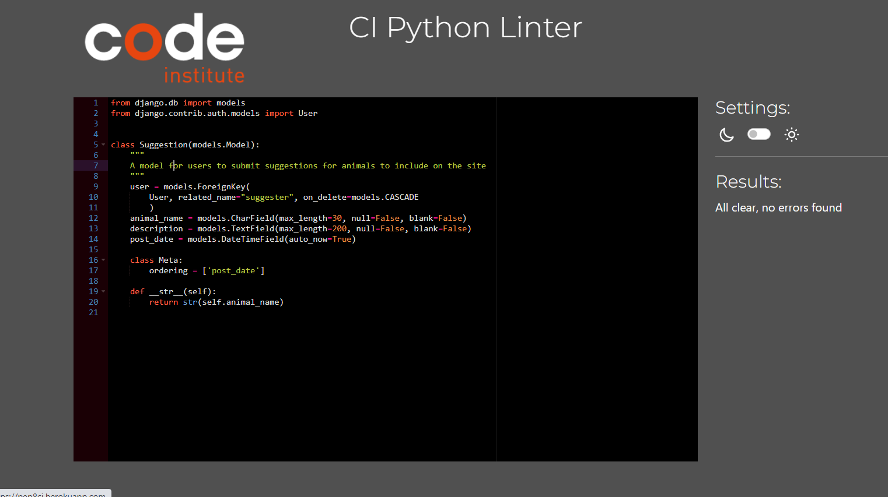 | Pass: No Errors |
| suggestion views.py | [PEP8 CI](https://pep8ci.herokuapp.com/https://raw.githubusercontent.com/CharlB96/capstoneproject-obscuripedia/suggestion/views.py) | 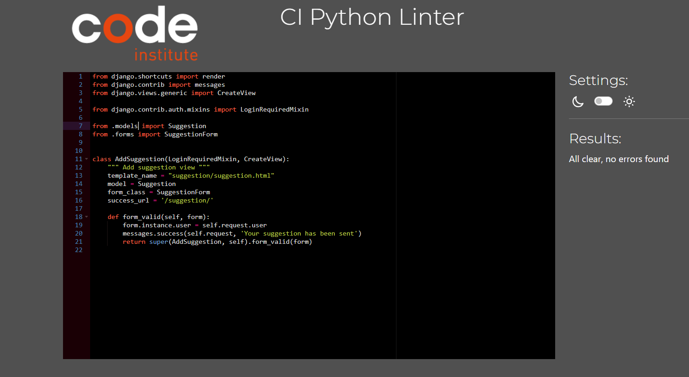 | Pass: No Errors |
| suggestion forms.py | [PEP8 CI](https://pep8ci.herokuapp.com/https://raw.githubusercontent.com/CharlB96/capstoneproject-obscuripedia/suggestion/forms.py) | 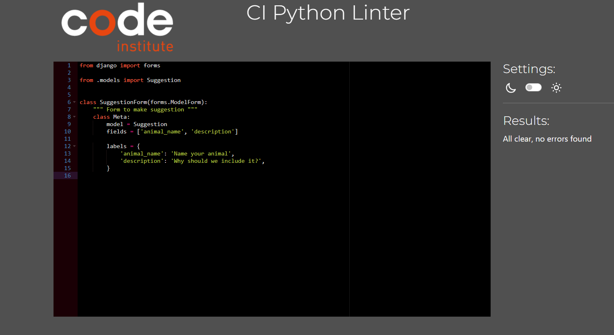 | Pass: No Errors |
| suggestion urls.py | [PEP8 CI](https://pep8ci.herokuapp.com/https://raw.githubusercontent.com/CharlB96/capstoneproject-obscuripedia/suggestion/urls.py) | | Pass: No Errors |
| pedia models.py | [PEP8 CI](https://pep8ci.herokuapp.com/https://raw.githubusercontent.com/CharlB96/capstoneproject-obscuripedia/pedia/models.py) | 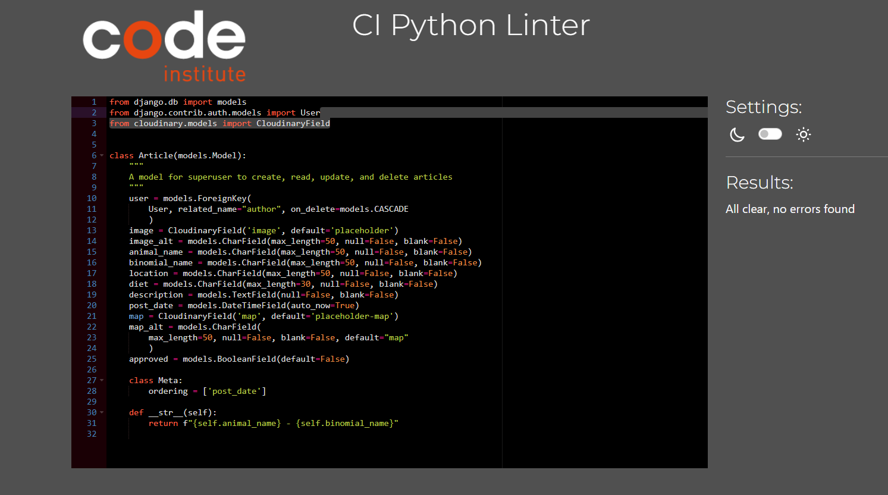 | Pass: No Errors |
| pedia views.py | [PEP8 CI](https://pep8ci.herokuapp.com/https://raw.githubusercontent.com/CharlB96/capstoneproject-obscuripedia/pedia/views.py) | 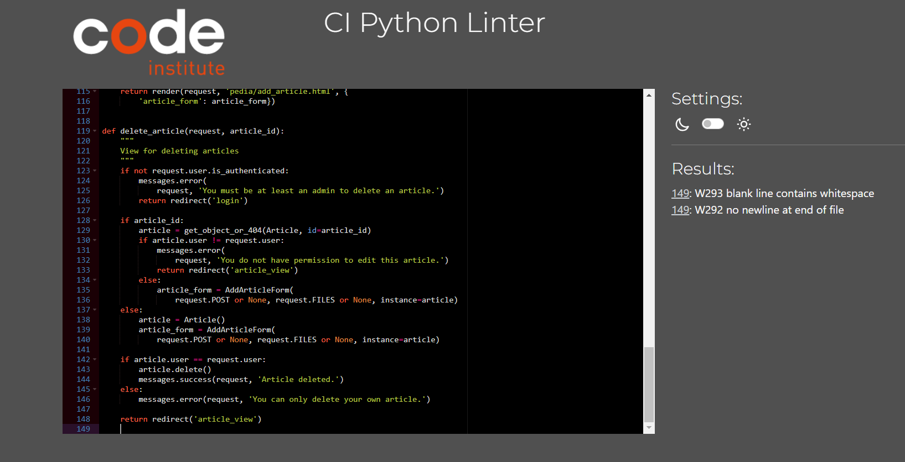 | Pass: No Errors |
| pedia admin.py | [PEP8 CI](https://pep8ci.herokuapp.com/https://raw.githubusercontent.com/CharlB96/capstoneproject-obscuripedia/pedia/admin.py) | 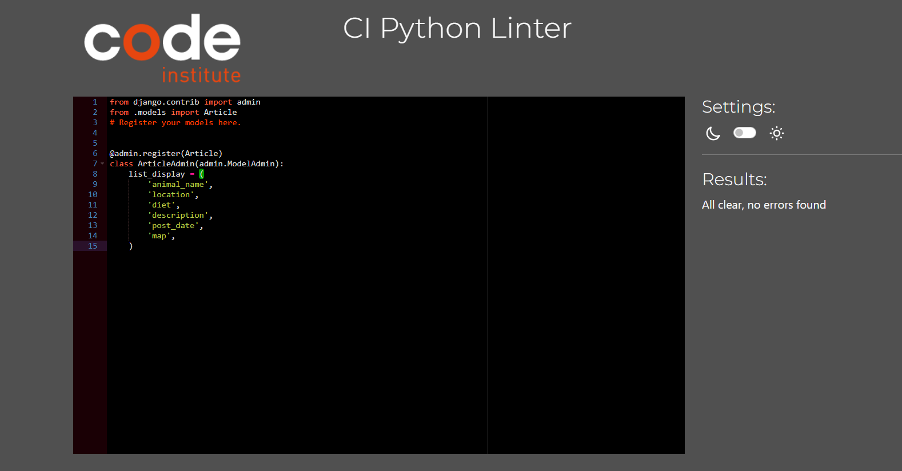 | Pass: No Errors |
| pedia fomrs.py | [PEP8 CI](https://pep8ci.herokuapp.com/https://raw.githubusercontent.com/CharlB96/capstoneproject-obscuripedia/pedia/forms.py) | 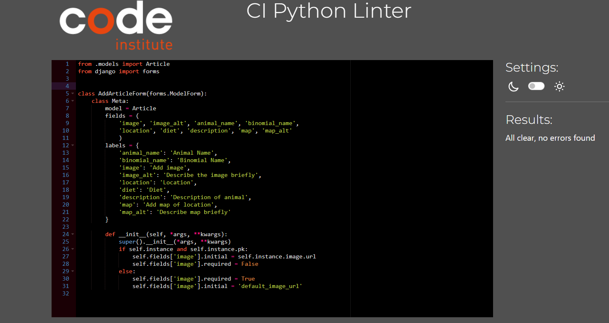 | Pass: No Errors |
| pedia urls.py | [PEP8 CI](https://pep8ci.herokuapp.com/https://raw.githubusercontent.com/CharlB96/capstoneproject-obscuripedia/pedia/urls.py) | 
 | Pass: No Errors |
