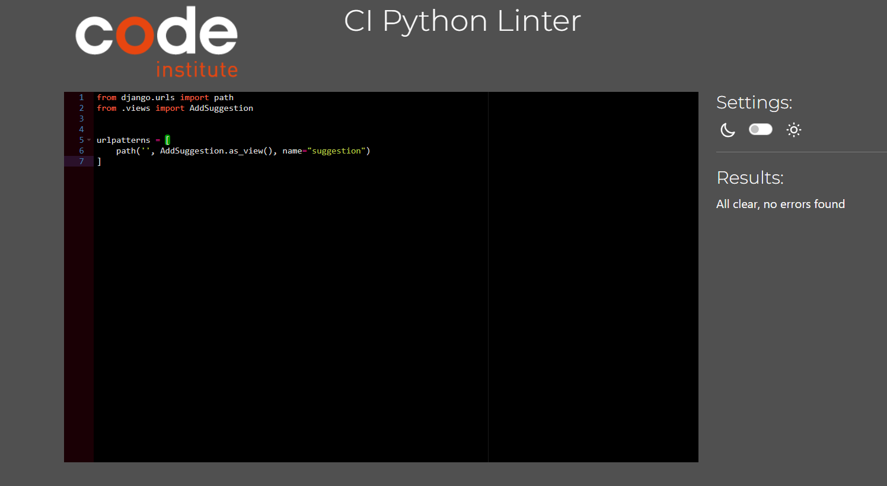
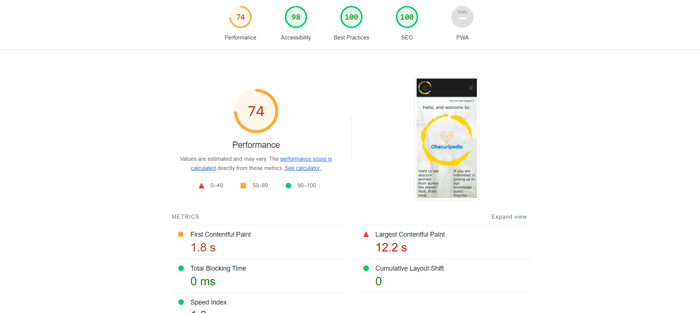

# Testing

Return back to the [README.md](README.md) file.

## Code Validation

### HTML

I have used the recommended [HTML W3C Validator](https://validator.w3.org) to validate all of my HTML files.

| Page | W3C URL | Screenshot | Notes |
| --- | --- | --- | --- |
| Home | [W3C](https://validator.w3.org/nu/?doc=https%3A%2F%2FCharlB96.github.io%2FCapstoneProject-Obscuripedia%2Findex.html) |  | Pass: No Errors |
| Suggestion | [W3C](https://validator.w3.org/nu/?doc=https%3A%2F%2FCharlB96.github.io%2FCapstoneProject-Obscuripedia%2Fsuggestion.html) |  | Pass: No Errors |
| Sign out | [W3C](https://validator.w3.org/nu/?doc=https%3A%2F%2FCharlB96.github.io%2FCapstoneProject-Obscuripedia%2Flogout.html) |  | Pass: No Errors |
| Login | [W3C](https://validator.w3.org/nu/?doc=https%3A%2F%2FCharlB96.github.io%2FCapstoneProject-Obscuripedia%2Flogin.html) |  | Pass: No Errors |
| Register | [W3C](https://validator.w3.org/nu/?doc=https%3A%2F%2FCharlB96.github.io%2FCapstoneProject-Obscuripedia%2Fsignup.html) |  | Validation claims floating elements, but the elements are all present. Django allauth was used for this page so there may be an issue in the baseline code for that |
| Articles | [W3C](https://validator.w3.org/nu/?doc=https%3A%2F%2FCharlB96.github.io%2FCapstoneProject-Obscuripedia%2Fpedia.html) |  | Pass: No Errors |
| Article detail | [W3C](https://validator.w3.org/nu/?doc=https%3A%2F%2FCharlB96.github.io%2FCapstoneProject-Obscuripedia%2Fpedia/20.html) |  | Pass: No Errors |
| Add article | [W3C](https://validator.w3.org/nu/?doc=https%3A%2F%2FCharlB96.github.io%2FCapstoneProject-Obscuripedia%2Fpedia/add.html) |  | Pass: No Errors |
| Edit article | [W3C](https://validator.w3.org/nu/?doc=https%3A%2F%2FCharlB96.github.io%2FCapstoneProject-Obscuripedia%2Fpedia/edit_article/20.html) |  | Pass: No Errors |

### CSS

I have used the recommended [CSS Jigsaw Validator](https://jigsaw.w3.org/css-validator) to validate all of my CSS files.

| File | Jigsaw URL | Screenshot | Notes |
| --- | --- | --- | --- |
| base.css | [Jigsaw](https://jigsaw.w3.org/css-validator/validator?uri=https%3A%2F%2FCharlB96.github.io%2FCapstoneProject-Obscuripedia) |  | Pass: No Errors |

### Python

I have used the recommended [PEP8 CI Python Linter](https://pep8ci.herokuapp.com) to validate all of my Python files.

| File | CI URL | Screenshot | Notes |
| --- | --- | --- | --- |
| main settings.py | [PEP8 CI](https://pep8ci.herokuapp.com/https://raw.githubusercontent.com/CharlB96/capstoneproject-obscuripedia/main/settings.py) |  | Pass: No Error |
| home views.py | [PEP8 CI](https://pep8ci.herokuapp.com/https://raw.githubusercontent.com/CharlB96/capstoneproject-obscuripedia/home/views.py) |  | Pass: No Error |
| home urls.py | [PEP8 CI](https://pep8ci.herokuapp.com/https://raw.githubusercontent.com/CharlB96/capstoneproject-obscuripedia/home/urls.py) |  | Pass: No Errors |
| suggestion models.py | [PEP8 CI](https://pep8ci.herokuapp.com/https://raw.githubusercontent.com/CharlB96/capstoneproject-obscuripedia/suggestion/models.py) |  | Pass: No Errors |
| suggestion views.py | [PEP8 CI](https://pep8ci.herokuapp.com/https://raw.githubusercontent.com/CharlB96/capstoneproject-obscuripedia/suggestion/views.py) |  | Pass: No Errors |
| suggestion forms.py | [PEP8 CI](https://pep8ci.herokuapp.com/https://raw.githubusercontent.com/CharlB96/capstoneproject-obscuripedia/suggestion/forms.py) |  | Pass: No Errors |
| suggestion urls.py | [PEP8 CI](https://pep8ci.herokuapp.com/https://raw.githubusercontent.com/CharlB96/capstoneproject-obscuripedia/suggestion/urls.py) | | Pass: No Errors |
| pedia models.py | [PEP8 CI](https://pep8ci.herokuapp.com/https://raw.githubusercontent.com/CharlB96/capstoneproject-obscuripedia/pedia/models.py) |  | Pass: No Errors |
| pedia views.py | [PEP8 CI](https://pep8ci.herokuapp.com/https://raw.githubusercontent.com/CharlB96/capstoneproject-obscuripedia/pedia/views.py) |  | Pass: No Errors |
| pedia admin.py | [PEP8 CI](https://pep8ci.herokuapp.com/https://raw.githubusercontent.com/CharlB96/capstoneproject-obscuripedia/pedia/admin.py) |  | Pass: No Errors |
| pedia fomrs.py | [PEP8 CI](https://pep8ci.herokuapp.com/https://raw.githubusercontent.com/CharlB96/capstoneproject-obscuripedia/pedia/forms.py) |  | Pass: No Errors |
| pedia urls.py | [PEP8 CI](https://pep8ci.herokuapp.com/https://raw.githubusercontent.com/CharlB96/capstoneproject-obscuripedia/pedia/urls.py) | 
 | Pass: No Errors |

## Browser Compatibility

I've tested my deployed project on multiple browsers to check for compatibility issues.

| Browser | Home | Suggestion | Articles | Article detail | Notes |
| --- | --- | --- | --- | --- | --- |
| Chrome |  |  |  |  | Works as expected |
| Firefox |  |  |  |  | The article detail page has elements that are much wider than they should. |
| Edge |  |  |  |  | Works as expected |

## Responsiveness

I've tested my deployed project on multiple devices to check for responsiveness issues.

| Browser | Home | Suggestion | Articles | Article detail | Notes |
| --- | --- | --- | --- | --- | --- |
| Mobile (DevTools) |  |  |  |  | Works as expected |
| Tablet (DevTools) |  |  |  |  | Works as expected |
| Desktop |  |  |  |  | Works as expected |

## Lighthouse audit

I've tested my deployed project using the Lighthouse Audit tool to check for any major issues.

| Page | Mobile | Desktop | Notes |
| --- | --- | --- | --- |
| Home |  |  | Some minor warnings |
| Articles |  |  | Slow response due to multiple images |
| Article detail |  |  | Slow response time due to images not having distinct sizes |

### Existing bugs

- Minor issue with articles page where cards overlap around the 760px to 560px width screens, fixing the issue results in the cards being different sizes and distorting the intended design outlook

### Solved Bugs

Dealt with various issues during develpoment including:
- App non functioning; forgot to place new app into installed apps section of settings.py
- Issue loading page; forgot to migrate after changing model
- Difficulty getting responsiveness; had to experiment with bootstrap classes until it was right
- Images not uploading when using form; added request.FILES to view
- Internal server error when deploying to heroku; commented out the STATIC_FILE_STORAGE in settings.py
- Edit article page was titled 'add an article' despite it being hardcoded to say 'edit article'; Coded an if statement onto the add article templte which seemed to work.
